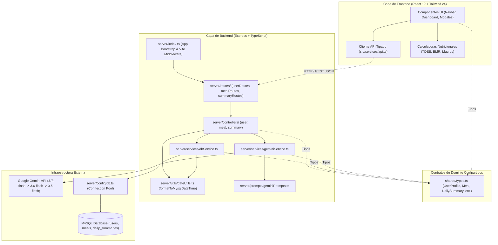
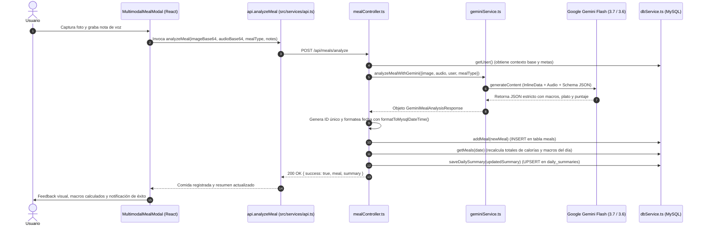
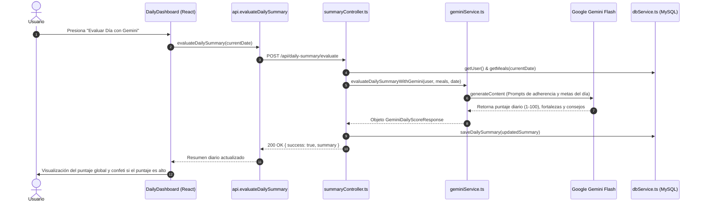

# Guía de Arquitectura de NutriVoice AI

Bienvenido a la documentación arquitectónica de **NutriVoice AI**. Este documento describe el diseño estructural del sistema, sus capas, los patrones arquitectónicos adoptados, el flujo de datos multimodal y la estrategia de resiliencia con Google Gemini y MySQL.

---

## 1. Visión General del Sistema

**NutriVoice AI** es una aplicación fullstack para el seguimiento nutricional inteligente y personalizado. Combina la captura visual de alimentos (fotografías) con notas de voz naturales y el perfil biométrico del usuario, procesándolos mediante modelos de lenguaje y visión multimodal de última generación (**Google Gemini 3.7 / 3.6 / 3.5 Flash**) y persistiendo los registros en una base de datos relacional (**MySQL**).

### Principios Arquitectónicos
1. **Separación de Responsabilidades (SoC):** Cada módulo tiene una función única y delimitada (controladores para HTTP, servicios para lógica de negocio/IA, configuración para infraestructura, utilidades para funciones puras).
2. **Contratos Compartidos (`shared/`):** El Frontend y el Backend comparten las mismas interfaces de TypeScript, evitando desincronización de modelos de datos o payloads de red.
3. **Cliente HTTP Tipado Centralizado (`api.ts`):** Los componentes de UI nunca invocan llamadas de red `fetch` directas ni construyen endpoints arbitrarios; consumen un servicio tipado.
4. **Resiliencia y Alta Disponibilidad de IA (Cascade & Retry):** El servicio de Gemini implementa reintentos automáticos con retroceso exponencial y conmutación por error (*fallback cascade*) entre modelos ante picos de demanda (errores 503/429).
5. **Integridad Temporal en Persistencia:** Las fechas y marcas de tiempo se formatean estrictamente en formato ISO y MySQL DATETIME (`YYYY-MM-DD HH:MM:SS`), desarmando y rearmando componentes de fecha para evitar truncamientos o errores de zona horaria.

---

## 2. Diagrama Arquitectónico



---

## 3. Estructura de Directorios

```text
calorie_tracker/
│
├── shared/                             # Contratos compartidos entre cliente y servidor
│   └── types.ts                        # Interfaces de dominio (UserProfile, Meal, DailySummary)
│
├── server/                             # Backend (Node.js / Express / TypeScript)
│   ├── config/
│   │   └── db.ts                       # Conexión y Pool de MySQL
│   ├── controllers/                    # Manejadores de solicitudes HTTP (Req/Res)
│   │   ├── userController.ts           # Perfil y metas biométricas
│   │   ├── mealController.ts           # Listado, análisis multimodal y borrado
│   │   └── summaryController.ts        # Resumen diario y evaluación integral
│   ├── database/
│   │   └── schema.sql                  # Esquema DDL y semillas de MySQL
│   ├── prompts/
│   │   └── geminiPrompts.ts            # Prompts del sistema e inyección de contexto
│   ├── routes/                         # Enrutadores Express modulares
│   │   ├── index.ts                    # Enrutador agregador (/api)
│   │   ├── userRoutes.ts               # Sub-ruta /api/profile
│   │   ├── mealRoutes.ts               # Sub-ruta /api/meals
│   │   └── summaryRoutes.ts            # Sub-ruta /api/daily-summary
│   ├── services/                       # Capa de servicios e integraciones
│   │   ├── dbService.ts                # Operaciones CRUD tipadas contra MySQL
│   │   └── geminiService.ts            # Comunicación multimodal y cascade con Gemini
│   ├── utils/
│   │   └── dateUtils.ts                # Funciones de parseo y formateo seguro de fechas
│   └── index.ts                        # Punto de entrada del servidor y middleware Vite
│
├── src/                                # Frontend (React 19 + TypeScript)
│   ├── components/                     # Componentes de interfaz categorizados
│   │   ├── layout/
│   │   │   └── Navbar.tsx              # Barra de navegación superior y selector de fecha
│   │   ├── dashboard/
│   │   │   └── DailyDashboard.tsx      # Métricas del día, calorías, macros y lista de platos
│   │   ├── meals/
│   │   │   ├── MultimodalMealModal.tsx # Grabador de voz, captura de fotos y envío a IA
│   │   │   └── MealDetailModal.tsx     # Visor de detalle del plato, macros y feedback
│   │   ├── profile/
│   │   │   └── UserProfileModal.tsx    # Modal de configuración de perfil y cálculo de metas
│   │   └── index.ts                    # Barrel export de componentes
│   ├── services/
│   │   └── api.ts                      # Cliente HTTP centralizado y tipado
│   ├── utils/
│   │   └── nutritionCalculators.ts     # Fórmulas de Harris-Benedict, TDEE y macros
│   ├── App.tsx                         # Orquestador del estado global de la vista
│   ├── main.tsx                        # Punto de montaje en el DOM
│   ├── index.css                       # Estilos base y directivas Tailwind CSS v4
│   ├── types.ts                        # Re-export hacia shared/types.ts
│   └── vite-env.d.ts                   # Declaración de variables de entorno de Vite
│
├── server.ts                           # Proxy de compatibilidad que importa server/index.ts
├── ARCHITECTURE.md                     # Este documento de arquitectura
├── GLOSSARY.md                         # Glosario detallado de archivos e interacciones
├── package.json                        # Scripts de desarrollo, compilación y dependencias
├── tsconfig.json                       # Configuración del compilador TypeScript
└── vite.config.ts                      # Configuración de empaquetado Vite
```

---

## 4. Capas del Sistema

### 4.1. Capa Compartida (`shared/`)
Garantiza un único punto de verdad (*Single Source of Truth*) para los tipos de datos:
- **`shared/types.ts`**: Contiene la definición de `UserProfile`, `Meal`, `DailySummary`, `MultimodalAnalysisRequest`, `GeminiMealAnalysisResponse` y `GeminiDailyScoreResponse`.
- Tanto el cliente como el servidor importan estos tipos directamente, garantizando coherencia en tiempo de compilación.

### 4.2. Capa de Presentación (`src/`)
Implementada con **React 19**, **Tailwind CSS v4** y **Lucide Icons**:
- **Desacoplamiento de Red:** Los componentes no hacen `fetch()`. En su lugar, invocan métodos de `src/services/api.ts`.
- **Estructuración por Dominios:** Los componentes están agrupados lógicamente en `layout/`, `dashboard/`, `meals/` y `profile/`.
- **Cálculos Biométricos Locales:** `src/utils/nutritionCalculators.ts` proporciona cálculos instantáneos de BMR (Tasa Metabólica Basal) mediante Harris-Benedict revisada, TDEE según nivel de actividad física y distribución inteligente de macronutrientes.

### 4.3. Capa de Controladores y Rutas (`server/controllers/`, `server/routes/`)
- **`routes/`**: Define los endpoints RESTful, aplicando métodos HTTP estándar (`GET`, `POST`, `DELETE`).
- **`controllers/`**: Extrae los parámetros de la solicitud, valida la entrada, coordina los servicios necesarios (`dbService`, `geminiService`, `dateUtils`) y envía la respuesta HTTP con los códigos de estado correspondientes.

### 4.4. Capa de Servicios (`server/services/`)
- **`dbService.ts`**: Abstrae todas las sentencias SQL parametrizadas (`pool.execute(...)`), asegurando protección contra inyecciones SQL y transformando filas de base de datos a objetos tipados.
- **`geminiService.ts`**: Encapsula el SDK `@google/genai`. Convierte imágenes a Base64 InlineData, convierte audio grabado a formato compatible de audio, inyecta el esquema JSON estricto (`Type.OBJECT`) y maneja la cascada de modelos ante picos de demanda.

### 4.5. Capa de Base de Datos (`server/database/`, `server/config/`)
- **MySQL 8.x**: Base de datos relacional que almacena:
  - `users`: Perfil biométrico, metas calóricas/macros, restricciones y notas.
  - `meals`: Comidas registradas, imágenes Base64, audios Base64, transcripciones, macros, desglose de ingredientes y puntaje.
  - `daily_summaries`: Consolidado del día, puntaje global (1-100), balance, fortalezas y áreas de mejora (UPSERT en base a `user_id` y `summary_date`).
- **`server/config/db.ts`**: Pool de conexiones gestionado que optimiza la reutilización de sockets y controla la concurrencia.

---

## 5. Flujos de Datos Principales

### 5.1. Flujo de Registro y Análisis Multimodal de Comida


### 5.2. Flujo de Evaluación Integral del Día


---

## 6. Seguridad y Resiliencia

1. **Gestión de Cargas Grandes:** Express está configurado con `limit: '50mb'` en `express.json` y `express.urlencoded` para admitir cargas multimodales directas de fotografías y clips de audio WAV/WebM en Base64 sin truncamiento.
2. **Cascada de Modelos de Gemini:**
   - Si `gemini-3.7-flash` arroja un error transitorio de alta demanda (HTTP 503 o 429), el servicio reintenta una vez con pausa exponencial y, en caso de persistir, conmuta automáticamente a `gemini-3.6-flash` y subsecuentemente a `gemini-3.5-flash`.
3. **Manejo Estricto de Fechas MySQL:**
   - La utilidad `formatToMysqlDateTime()` extrae explícitamente el año, mes, día, hora, minutos y segundos rellenando con ceros (`padStart(2, '0')`), previniendo errores de conversión de strings ISO con sufijo 'Z' en columnas de tipo `DATETIME`.
4. **Consultas Parametrizadas:**
   - Todas las llamadas a la base de datos se realizan a través de marcadores de posición `?` en `mysql2/promise`, garantizando inmunidad frente a ataques de inyección SQL.

